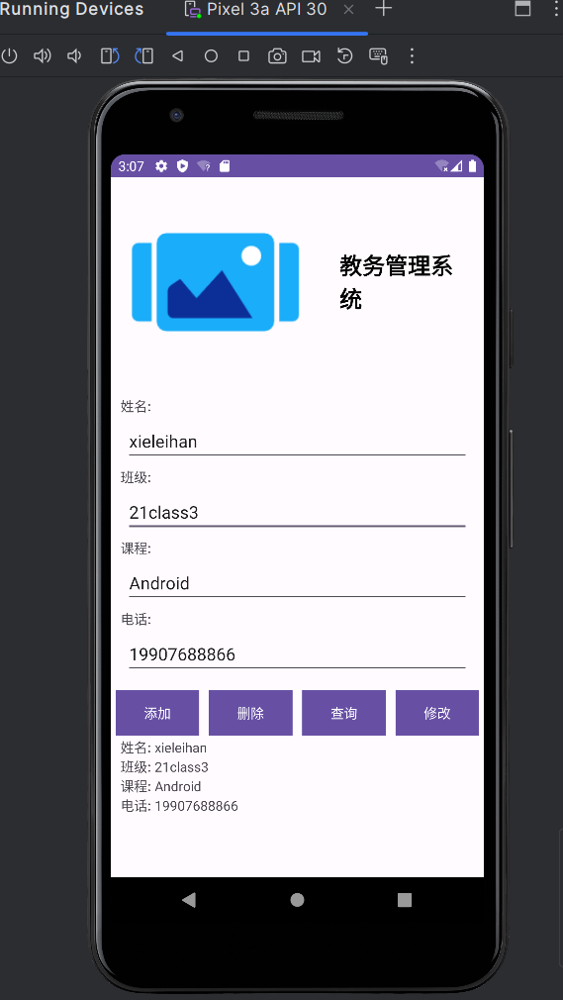

# AndroidProject-finalSchoolHomework
Android项目:主要是完成学校期末大作业需要,符合学校的要求,但是不符合商业要求,可以弃用


> 项目使用的IDE:Android studio最新版本,Gradle也是最新版本

学校期末大作业的要求是,实现对主布局页面如图片类似效果的,该部分源码在`activity_main.xml`里,主要是用上相对布局的方式,基本可用可看.然后在Java文件夹里,`MainActivity.java`主要放实现**Android SQLLite**的源码.

其余是用来连接等外部类,具体请自己分析

## 项目结构

```text
/docs
    ├── README.md               # 主页及项目介绍
    ├───android
    │   ├───app
    │   └───src
    └───gradle

```

## 项目展示



## 编译

本项目 Android 工程部分已编译为 apk 安装包，可直接在项目[发布页面](https://github.com/linyiLYi/pose-monitor/releases/tag/release)下载安装进行测试。如需进一步开发测试，可以在 Android Studio 中对安卓工程文件进行编译。

### 准备工作

- 安卓项目的编译需要 Android Studio，可以进入[官方网站](https://developer.android.com/studio/install?hl=zh-cn)按照说明进行下载安装。
- 需要准备一部安卓手机。

### 编译程序

- 通过 `git clone` 克隆本项目，或者以压缩包形式下载项目文件并解压。
- 打开 Android Studio，在初始的 `Welcome` 界面选择 `Open an existing Android Studio project`，打开项目中的安卓工程文件夹。
- 安卓工程文件位于本项目的 `android/` 文件夹下。在 Android Studio 的提示窗口中选择该文件夹。项目打开后软件可能会提示需要进行 Gradle 同步，同意并等待同步完成即可。
- 将处于开发者模式的手机通过 USB 线连接到电脑，具体连接方法可以参考[官方教程](https://developer.android.com/studio/run/device?hl=zh-cn)。如果程序顶部工具栏右侧正确显示了你的手机型号，说明设备连接成功。
- 如果是首次安装 Android Studio，可能还需要安装一系列开发工具。点击软件界面右上角的绿色三角按钮`Run 'app'`直接运行程序。如果有需要安装的工具，系统会进行提示，按照提示依次安装即可。
